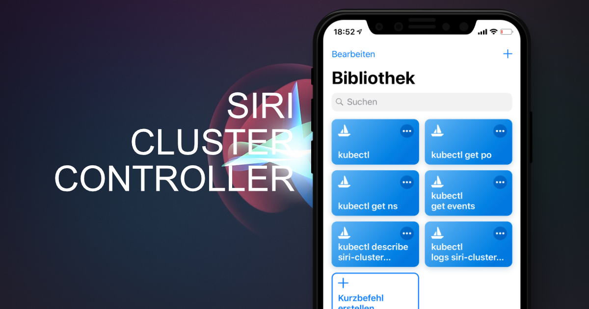
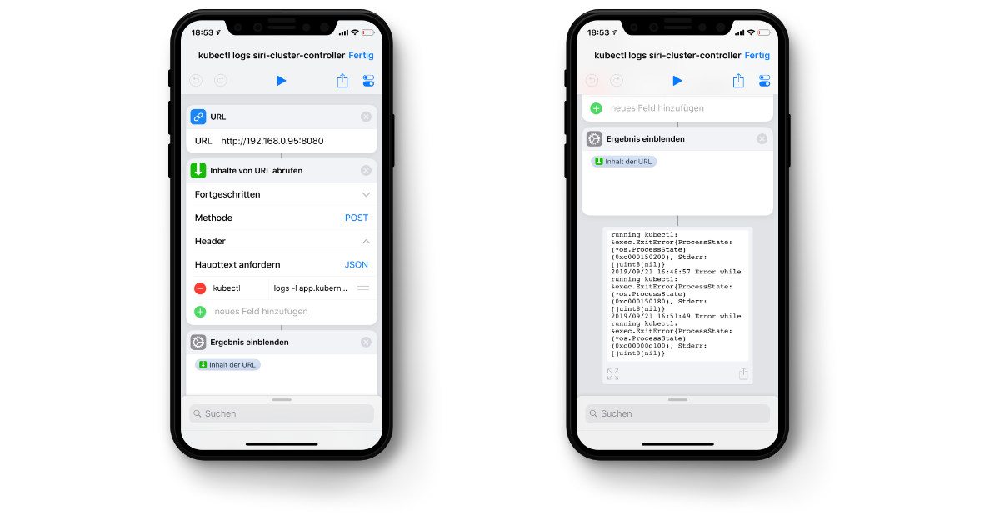
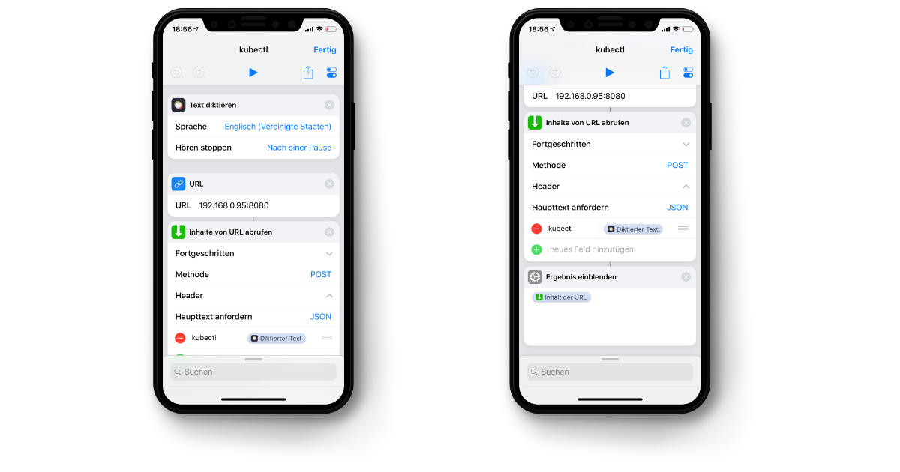

The **Siri Cluster Controller** is a small experiment to test [iOS shortcuts](https://support.apple.com/guide/shortcuts/welcome/ios). With the controller you can create shortcuts and control your Kubernetes cluster via Siri. To play arround with the Siri Cluster Controller you can use the deployment file from this repository, forward the port of the created pod to you local machine and point the shortcuts to the IP of you machine.

```sh
kubectl apply -f https://raw.githubusercontent.com/ricoberger/siri-cluster-controller/master/deployment.yaml
kubectl port-forward --address 0.0.0.0 siri-cluster-controller-*** 8080
```

> **Attention:** The deployment should not be used in production clusters. The Siri Cluster Controller has all rights to create, list, get and delete resources.



